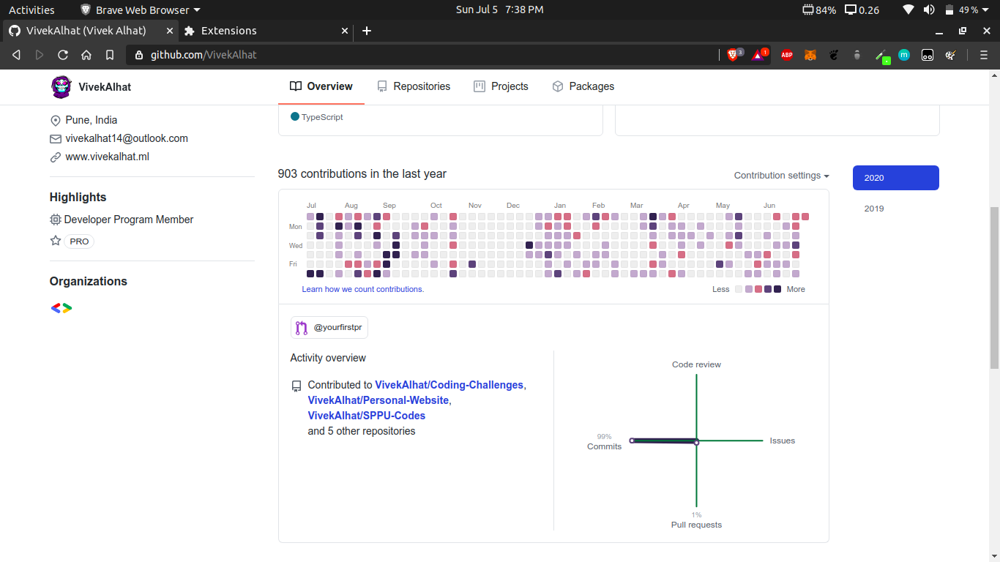

# Git-Colorizer
Web extension to change color of github graph, activity overview and progress bar.\
Currently only single color theme is available, you can modify the colors in source code and use it as you like.\
If you like this extension, don't forget to star it.

